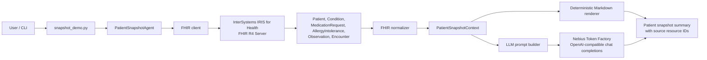

# FHIR Patient Snapshot Agent

FHIR Patient Snapshot Agent is an AI-powered clinical summarisation tool built for the InterSystems AI Agents and FHIR Programming Contest.

The application retrieves structured FHIR resources for a selected patient from an InterSystems IRIS for Health FHIR Server and generates a concise clinical summary.

## Contest Idea

The project implements a Smart Patient Summary Generator: an AI agent called inside a FHIR interoperability solution.

Idea link: https://community.intersystems.com/post/intersystems-programming-contest-ai-agents-fhir

## FHIR Resources Used

- Patient
- Condition
- MedicationRequest
- AllergyIntolerance
- Observation
- Encounter

## Core Workflow

1. A user selects or provides a `patient_id`.
2. The app queries FHIR R4 resources from InterSystems IRIS for Health FHIR Server.
3. A Python layer extracts and normalises relevant clinical context.
4. The app can render a deterministic Markdown summary, build an LLM-ready prompt, or call an OpenAI-compatible LLM provider.
5. The output includes the source FHIR resources used so generated content can be verified.

## Architecture



IRIS for Health is the FHIR interoperability layer in this project. The Python agent does not read local files or query a database directly; it retrieves standards-based FHIR R4 JSON from IRIS and uses those resources as the source of truth for summarisation.

## Summary Output

- Patient overview
- Active problems
- Medications
- Allergies
- Recent observations and labs
- Red flags or follow-up points
- Missing information
- Source FHIR resources used

## Safety Note

This project is for demonstration purposes only. It does not provide diagnosis, treatment recommendations, or clinical decision-making. All generated summaries must be verified against the source FHIR data.

## Tech Stack

- InterSystems IRIS for Health / FHIR Server
- Python
- FHIR R4
- Nebius Token Factory / OpenAI-compatible chat completions
- Docker

## Current Features

- FHIR R4 client with Basic Auth support
- Local `.env` loading without external dependencies
- Patient snapshot resource fetch across Patient, Condition, MedicationRequest, AllergyIntolerance, Observation, and Encounter
- FHIR Bundle extraction and clinical context normalisation
- Deterministic Markdown summary mode
- LLM-ready prompt mode
- Nebius/OpenAI-compatible LLM summary mode
- Streamlit web UI for patient ID entry and summary display
- Unit tests for normalisation and LLM response parsing
- Sample LLM output for Patient `1`

## Repository Structure

```text
.
+-- app/
|   +-- fhir_client.py
|   +-- llm_provider.py
|   +-- normalizer.py
|   +-- prompt_builder.py
|   +-- summary_renderer.py
|   +-- snapshot_demo.py
|   +-- web_ui.py
+-- tests/
|   +-- test_normalizer.py
+-- docs/
|   +-- day1_fhir_setup.md
|   +-- demo_script.md
|   +-- sample_patient_1_llm_summary.md
+-- .env.example
+-- .gitignore
+-- README.md
+-- requirements.txt
```

## Local FHIR Server Setup

The local FHIR server setup uses the InterSystems community FHIR template as the reference starting point:

https://github.com/intersystems-community/iris-fhir-template

Clone and run that template separately:

```powershell
git clone https://github.com/intersystems-community/iris-fhir-template.git iris-challenge-ai-agent
cd iris-challenge-ai-agent
docker compose up --build
```

The project currently expects this FHIR base URL:

```text
http://localhost:32783/fhir/r4
```

The local InterSystems template exposes the FHIR port through Docker. Check `docker ps` and use the host port mapped to container port `52773`. In our first local run this was `32783`.

The local template also requires Basic Auth:

```text
FHIR_USERNAME=_SYSTEM
FHIR_PASSWORD=SYS
```

Verify the local FHIR API:

```bash
curl -i -u _SYSTEM:SYS http://localhost:32783/fhir/r4/metadata
curl -s -u _SYSTEM:SYS http://localhost:32783/fhir/r4/Patient | python3 -m json.tool
curl -s -u _SYSTEM:SYS http://localhost:32783/fhir/r4/Condition | python3 -m json.tool
curl -s -u _SYSTEM:SYS http://localhost:32783/fhir/r4/Observation | python3 -m json.tool
```

## Configuration

Create a local `.env` file:

```text
FHIR_BASE_URL=http://localhost:32783/fhir/r4
FHIR_USERNAME=_SYSTEM
FHIR_PASSWORD=SYS
LLM_BASE_URL=https://api.tokenfactory.nebius.com/v1
LLM_MODEL=meta-llama/Llama-3.3-70B-Instruct
LLM_API_KEY=your-nebius-token
```

Local `.env` files are loaded automatically and are ignored by Git.

## Python Setup

```bash
python -m venv .venv
source .venv/bin/activate
pip install -r requirements.txt
```

On Windows PowerShell:

```powershell
py -m venv .venv
.\.venv\Scripts\Activate.ps1
pip install -r requirements.txt
```

## Run

Run a deterministic patient snapshot:

```bash
python -m app.snapshot_demo 1
```

Generate an LLM-ready prompt:

```powershell
python -m app.snapshot_demo 1 --format prompt
```

Generate a summary with Nebius Token Factory or another OpenAI-compatible provider:

```powershell
python -m app.snapshot_demo 1 --format llm
```

Return only resource counts:

```powershell
python -m app.snapshot_demo 1 --format counts
```

Run the Streamlit web UI:

```powershell
streamlit run app/web_ui.py
```

Sample output: `docs/sample_patient_1_llm_summary.md`

Demo walkthrough: `docs/demo_script.md`

## Tests

Run tests:

```bash
python -m unittest
```

## Status

Working prototype:

- Local InterSystems IRIS for Health FHIR Server verified
- Patient `1` verified with 5 conditions, 2 medication requests, 0 allergy records, 88 observations, and 14 encounters
- Deterministic summary mode works
- LLM prompt mode works
- Nebius Token Factory LLM summary mode works
- Streamlit web UI is available
- Tests pass

## Roadmap

1. Improve observation grouping for vitals, labs, and survey observations.
2. Add more tests with saved FHIR fixture bundles.
3. Add screenshots or a short recorded video demo.
4. Decide whether to embed Docker/FHIR setup in this repo or keep the InterSystems template as an external setup step.
