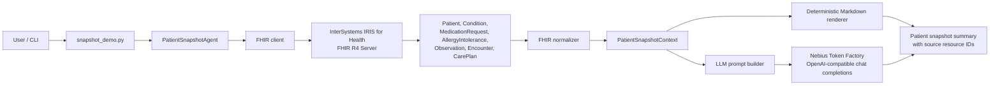
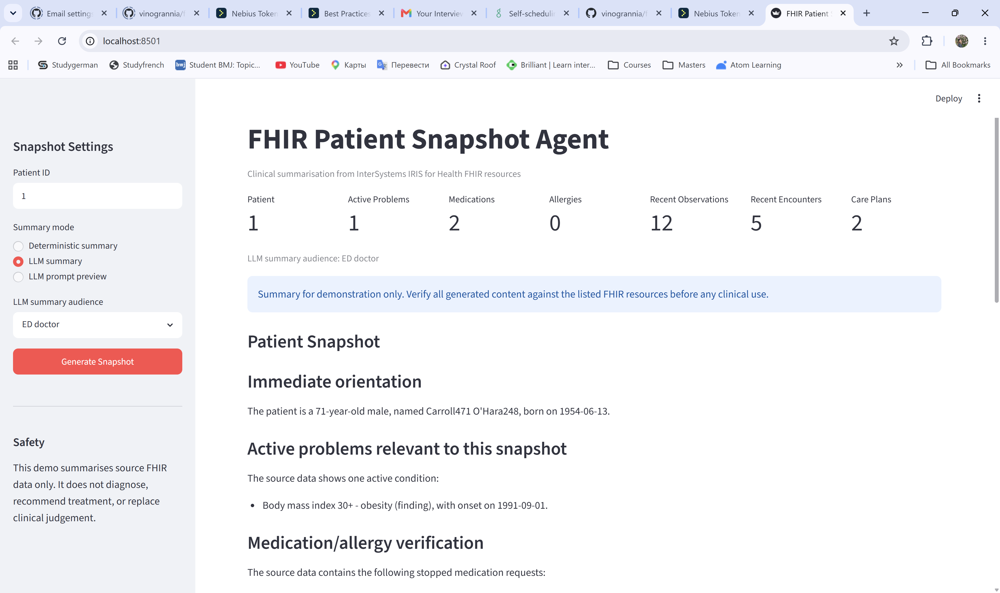
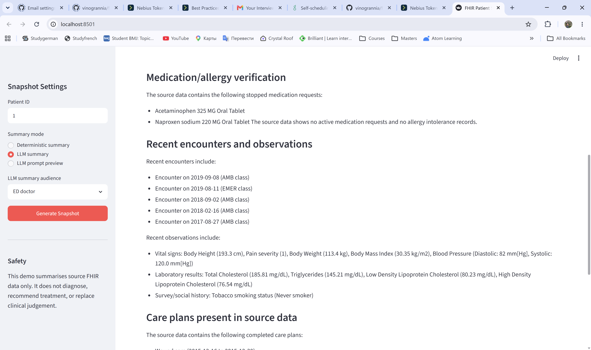
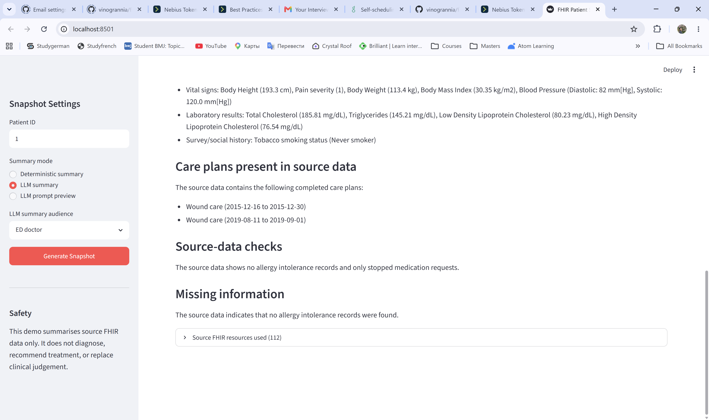

# FHIR Patient Snapshot Agent

FHIR Patient Snapshot Agent is an AI-powered clinical summarisation tool built for the InterSystems AI Agents and FHIR Programming Contest.

The application retrieves structured FHIR resources for a selected patient from an InterSystems IRIS for Health FHIR Server and generates a concise clinical summary.

## Contest Idea

The project implements a Smart Patient Summary Generator: an AI agent called inside a FHIR interoperability solution.

Idea link: https://community.intersystems.com/post/intersystems-programming-contest-ai-agents-fhir

## FHIR Resources Used

- Patient
- Condition
- MedicationRequest
- AllergyIntolerance
- Observation
- Encounter
- CarePlan

## Core Workflow

1. A user selects or provides a `patient_id`.
2. The app queries FHIR R4 resources from InterSystems IRIS for Health FHIR Server.
3. A Python layer extracts and normalises relevant clinical context.
4. The app can render a deterministic Markdown summary, build an LLM-ready prompt, or call an OpenAI-compatible LLM provider.
5. The output includes the source FHIR resources used so generated content can be verified.

## Architecture



IRIS for Health is the FHIR interoperability layer in this project. The Python agent does not read local files or query a database directly; it retrieves standards-based FHIR R4 JSON from IRIS and uses those resources as the source of truth for summarisation.

## Summary Output

- Patient overview
- Active problems
- Medications
- Allergies
- Recent observations and labs
- Care plans
- Role-specific summary framing
- Source-data checks
- Missing information
- Source FHIR resources used

## Safety Note

This project is for demonstration purposes only. It does not provide diagnosis, treatment recommendations, or clinical decision-making. All generated summaries must be verified against the source FHIR data.

The LLM prompt explicitly prohibits creating new care plans, monitoring recommendations, medication changes, referrals, and treatment follow-up instructions. Existing FHIR CarePlan resources may be summarised as source data. Potential concerns are framed as neutral source-data checks only.

The Missing Information section is constrained to items identified by the deterministic normalizer, which reduces the risk of the model inventing extra clinical gaps.

The prompt also requests Markdown headings, bullet lists, blank lines between sections, and readable clinical language instead of raw source-context line copying. FHIR resource IDs are kept out of narrative sections and shown in the collapsible source-resource review. The web UI applies compact display cleanup for common LLM Markdown spacing issues across role-specific summaries, including unbulleted lists after subsection labels and empty bullet points.

## Tech Stack

- InterSystems IRIS for Health / FHIR Server
- Python
- FHIR R4
- Nebius Token Factory / OpenAI-compatible chat completions
- Docker

## Current Features

- FHIR R4 client with Basic Auth support
- Local `.env` loading without external dependencies
- Patient snapshot resource fetch across Patient, Condition, MedicationRequest, AllergyIntolerance, Observation, Encounter, and CarePlan
- FHIR Bundle extraction and clinical context normalisation
- Observation grouping for recent vitals, labs, survey/social history, and other observations
- Deterministic Markdown summary mode
- LLM-ready prompt mode
- Nebius/OpenAI-compatible LLM summary mode
- Role-specific prompt sections for clinicians, ED doctors, care managers, patients, and family caregivers
- Prompt rules for readable Markdown output and source-data checks limited to data-quality/source-grounding facts
- UI cleanup that keeps FHIR resource IDs out of the narrative summary while preserving them in source review
- Streamlit web UI for patient ID entry, summary display, and collapsible source-resource review
- Observation visuals for numeric FHIR Observation values in the Streamlit UI
- Source context vector search over normalized patient snapshot sections
- Embedded Python demo class for IRIS-compatible package review
- Unit tests for normalisation and LLM response parsing
- Sample LLM output for Patient `1`

## Contest Bonus Features

This project is designed to align closely with the InterSystems AI Agents and FHIR Programming Contest goals:

- Suggested task fit: implements the Smart Patient Summary Generator / FHIR Patient Snapshot Agent idea from the contest prompt.
- Developer Community Idea fit: includes observation visuals related to DPI-I-388, "Custom Visualizations for Physicians": https://ideas.intersystems.com/ideas/DPI-I-388
- InterSystems usage: uses InterSystems IRIS for Health as the local FHIR R4 server and source system for patient resources.
- Vector Search usage: includes source context vector search over normalized patient snapshot sections in the Streamlit UI.
- Embedded Python usage: includes IRIS classes with Embedded Python methods for extracting numeric observation values and computing vector-search cosine similarity.
- AI usage: calls an LLM through Nebius Token Factory using an OpenAI-compatible chat completions API.
- Model used: `meta-llama/Llama-3.3-70B-Instruct`.
- Docker usage: Docker is used in two places: the local InterSystems IRIS for Health FHIR Server runs through the external InterSystems community FHIR template, and this repository includes a Dockerfile plus `docker-compose.demo.yml` for running the Python/Streamlit online demo mode.
- IPM/ZPM metadata: includes `module.xml` with package metadata and file-copy entries for the demo assets.
- Demo readiness: includes screenshots, sample output, a demo script, a YouTube video walkthrough, and a hosted online demo of the working app.
- Developer Community article: https://community.intersystems.com/post/building-fhir-patient-snapshot-agent-iris-health-streamlit-and-llm
- Documentation feedback: reported a FHIR template README improvement suggestion for authenticated FHIR API verification examples: https://github.com/intersystems-community/iris-fhir-template/issues/37
- First-time contribution: structured as a clear, beginner-friendly open-source contest submission with setup steps, safety framing, tests, and reproducible local commands.

## Demo Preview

The current demo uses Patient `1` from the local InterSystems IRIS for Health FHIR Server.

YouTube video demo: https://youtu.be/Hsu10Nnujng

Online demo: https://fhir-patient-snapshot-agent.onrender.com/

Developer Community article: https://community.intersystems.com/post/building-fhir-patient-snapshot-agent-iris-health-streamlit-and-llm

Online demo deployment is supported through `render.yaml`. For public hosting, set `ONLINE_DEMO_MODE=1`. In this mode the Streamlit app uses a bundled Patient `1` demo context captured from the local IRIS for Health FHIR Server setup, so the public app does not need access to a local `localhost` FHIR endpoint or a private LLM API key. The full live FHIR workflow still runs locally against InterSystems IRIS for Health as described below.

Verified resource counts:

- Patient: 1
- Condition: 5
- MedicationRequest: 2
- AllergyIntolerance: 0
- Observation: 88
- Encounter: 14
- CarePlan: 2

Sample generated summary: `docs/sample_patient_1_llm_summary.md`

### Streamlit Web UI Screenshots

The Streamlit UI allows a user to enter a FHIR patient ID, choose the summary audience, generate a deterministic or LLM-backed patient snapshot, and review the source FHIR resources used by the agent.







## Repository Structure

```text
.
+-- app/
|   +-- fhir_client.py
|   +-- llm_provider.py
|   +-- normalizer.py
|   +-- prompt_builder.py
|   +-- summary_renderer.py
|   +-- snapshot_demo.py
|   +-- vector_search.py
|   +-- web_ui.py
+-- tests/
|   +-- test_normalizer.py
|   +-- test_vector_search.py
+-- src/
|   +-- FHIR/
|       +-- Snapshot/
|           +-- EmbeddedPythonDemo.cls
|           +-- EmbeddedVectorSearch.cls
+-- docs/
|   +-- bonus_validation.md
|   +-- day1_fhir_setup.md
|   +-- demo_script.md
|   +-- developer_community_article.md
|   +-- fhir_template_issue.md
|   +-- sample_patient_1_llm_summary.md
|   +-- screenshots/
|       +-- streamlit_ed_summary_top.png
|       +-- streamlit_ed_summary_middle.png
|       +-- streamlit_ed_summary_bottom.png
+-- .env.example
+-- .gitignore
+-- Dockerfile
+-- README.md
+-- docker-compose.demo.yml
+-- module.xml
+-- render.yaml
+-- requirements.txt
```

## Local FHIR Server Setup

The local FHIR server setup uses the InterSystems community FHIR template as the reference starting point:

https://github.com/intersystems-community/iris-fhir-template

Clone and run that template separately:

```powershell
git clone https://github.com/intersystems-community/iris-fhir-template.git iris-challenge-ai-agent
cd iris-challenge-ai-agent
docker compose up --build
```

The project currently expects this FHIR base URL:

```text
http://localhost:32783/fhir/r4
```

The local InterSystems template exposes the FHIR port through Docker. Check `docker ps` and use the host port mapped to container port `52773`. In our first local run this was `32783`.

The local template also requires Basic Auth:

```text
FHIR_USERNAME=_SYSTEM
FHIR_PASSWORD=SYS
```

Verify the local FHIR API:

```bash
curl -i -u _SYSTEM:SYS http://localhost:32783/fhir/r4/metadata
curl -s -u _SYSTEM:SYS http://localhost:32783/fhir/r4/Patient | python3 -m json.tool
curl -s -u _SYSTEM:SYS http://localhost:32783/fhir/r4/Condition | python3 -m json.tool
curl -s -u _SYSTEM:SYS http://localhost:32783/fhir/r4/Observation | python3 -m json.tool
```

## Configuration

Create a local `.env` file:

```text
FHIR_BASE_URL=http://localhost:32783/fhir/r4
FHIR_USERNAME=_SYSTEM
FHIR_PASSWORD=SYS
LLM_BASE_URL=https://api.tokenfactory.nebius.com/v1
LLM_MODEL=meta-llama/Llama-3.3-70B-Instruct
LLM_API_KEY=your-nebius-token
```

Local `.env` files are loaded automatically and are ignored by Git.

## Python Setup

```bash
python -m venv .venv
source .venv/bin/activate
pip install -r requirements.txt
```

On Windows PowerShell:

```powershell
py -m venv .venv
.\.venv\Scripts\Activate.ps1
py -m pip install -r requirements.txt
```

## Run

Run a deterministic patient snapshot:

```bash
python -m app.snapshot_demo 1
```

Generate an LLM-ready prompt:

```powershell
python -m app.snapshot_demo 1 --format prompt
```

Generate a role-specific prompt:

```powershell
python -m app.snapshot_demo 1 --format prompt --audience patient
```

Generate a summary with Nebius Token Factory or another OpenAI-compatible provider:

```powershell
python -m app.snapshot_demo 1 --format llm
```

Supported audiences: `clinician`, `ed_doctor`, `care_manager`, `patient`, and `family_caregiver`. Each audience uses a different required section template.

Return only resource counts:

```powershell
python -m app.snapshot_demo 1 --format counts
```

Run the Streamlit web UI:

```powershell
py -m streamlit run app/web_ui.py
```

Run the Streamlit web UI in public online demo mode:

```powershell
$env:ONLINE_DEMO_MODE="1"
py -m streamlit run app/web_ui.py
```

Run the Streamlit online demo mode with Docker:

```bash
docker compose -f docker-compose.demo.yml up --build
```

Then open `http://localhost:8501`.

## IPM / ZPM Metadata

This repository includes `module.xml` with package metadata for InterSystems Package Manager / ZPM-oriented review. The application runtime remains the Python/Streamlit agent plus the InterSystems IRIS for Health FHIR Server setup described above.

Bonus validation notes: `docs/bonus_validation.md`

## Vector Search

The Streamlit UI includes source context vector search over normalized patient snapshot sections. It vectorizes section text with token-frequency vectors and ranks matching sections using cosine similarity, allowing quick lookup across medications, allergies, observations, encounters, care plans, and missing information.

## Embedded Python

The repository includes IRIS-compatible ObjectScript classes with Embedded Python methods:

```objectscript
ClassMethod NormalizeObservationValue(value As %String) As %String [ Language = python ]
ClassMethod Vectorize(text As %String) As %String [ Language = python ]
ClassMethod CosineSimilarity(leftVectorJson As %String, rightVectorJson As %String) As %String [ Language = python ]
```

These demo methods extract numeric observation values, create token-frequency vectors, and compute cosine similarity inside Embedded Python. They are included as InterSystems Embedded Python artifacts for package review.

Sample output: `docs/sample_patient_1_llm_summary.md`

Demo walkthrough: `docs/demo_script.md`

Developer Community article: https://community.intersystems.com/post/building-fhir-patient-snapshot-agent-iris-health-streamlit-and-llm

Article draft: `docs/developer_community_article.md`

## Tests

Run tests:

```bash
python -m unittest discover -s tests
```

## Status

Working prototype:

- Local InterSystems IRIS for Health FHIR Server verified
- Patient `1` verified with 5 conditions, 2 medication requests, 0 allergy records, 88 observations, 14 encounters, and 2 care plans
- Recent observations are grouped into vitals, labs, survey/social history, and other observations
- Deterministic summary mode works
- LLM prompt mode works
- Nebius Token Factory LLM summary mode works
- Role-specific summary framing works in CLI and Streamlit UI
- Streamlit web UI is available
- Tests pass

## Roadmap

1. Add more tests with saved FHIR fixture bundles.
2. Decide whether to embed Docker/FHIR setup in this repo or keep the InterSystems template as an external setup step.
